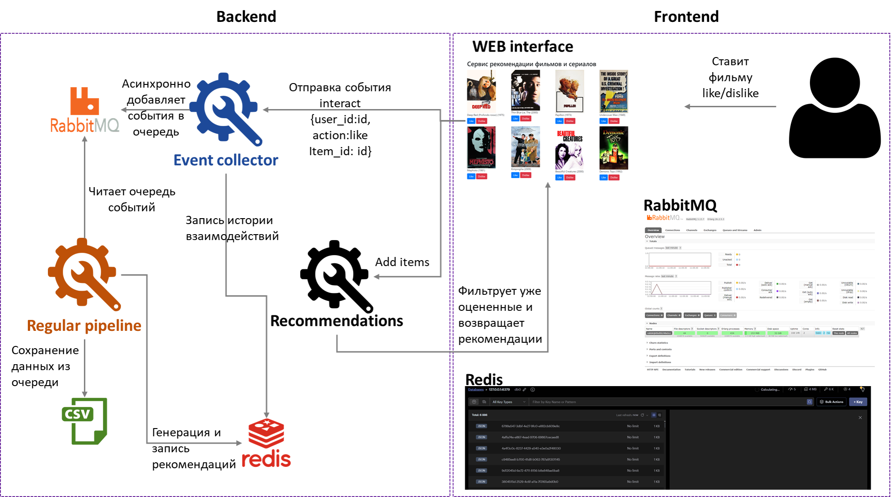

# Финальный проект

Сервис рекомендаций фильмов и сериалов, использует данные о лайках/дизлайках пользователей.

## Описание рекомендательной системы
Рекомендательная система состоит из трех основных компонент:

**Recommendations service**\

Бекенд сервис, отвечающий за рекомендации конечным пользователям, имеющая следующие эндпоинты (роуты/ручки):
- /healthcheck возвращает статус сервиса. Для грейдера необходимо, чтобы возвращался код ответа 200 (OK)
- /cleanup производит сброс окружения перед новым запуском грейдера (при каждом запуске идентификаторы новые и нужно очистить все возможные кэширования для корректной проверки)
- /add_items добавляет в систему новые объекты рекомендации (поле item_ids содержит список идентификаторов объектов, а genres – список списков жанров для соответствующих объектов в item_ids)
- /recs/{user_id} возвращает список рекомендаций в виде списка объектов для пользователя user_id
При проверке запросы будут идти на 5001 порт

**Event collector**\
Сервис сбора и обработки реакции пользователей (лайки/дизлайки), обрабатывающий эндпоинт /interact. В бейзлайне просто сохраняет полученные события в RabbitMQ для дальнейшей обработки в сервисе Regular pipeline.\
При проверке запросы будут идти на 5000 порт

**Regular pipeline**\
Аналог планировщика задач Airflow/Luigi, в случае данного задания просто скрипт с циклическим обучением алгоритмов. Рекомендуется сохранять список рекомендаций непосредственно в Redis, а вектора в Quadrant для быстрой обработки запросов пользователей. Читает очередь событий, сохраняет в csv, по которому строятся топ 100 рекомендаций, которые сохраняются в Redis

## Запуск
1) из корня проекта: `pip install -r requirements.txt`
1) Запуск redis командой
docker run -d --name redis-tmp --rm -p 6379:6379 redis/redis-stack-server:latest
docker run -d --name redis-ui -p 5540:5540 -e REDIS_HOST=redis -e REDIS_PORT=6379 -e REDIS_PASSWORD=mypassword redis/redisinsight:latest
как хост в ui redis ввести host.docker.internal или для виртуальной машины: 37.27.176.57\
Username: default\
Password: mypassword\
2) Запуск RabbitMq командой `docker run -d --rm --name rabbitmq -p 5672:5672 -p 5673:5673 -p 15672:15672 rabbitmq:3-management`
3) Запуск event_collector `uvicorn event_collector.main:app --port 5000 --host 0.0.0.0`
4) Запуск recommendations `uvicorn recommendations.main:app --port 5001 --host 0.0.0.0`
5) Запуск web_app: `cd webapp python app.py`
6) Запуск regular_pipeline: `cd regular_pipeline python main.py` 
При запуске regular_pipeline может возникать ошибка exceptions.ColumnNotFoundError: item_ids,"хороший поинт, тут было предположение, что regular_pipeline запускается только после того, как начали поступать сообщения в очередь как временная мера, можно добавить в условие if data, попробую на выходных это обновить в архиве"